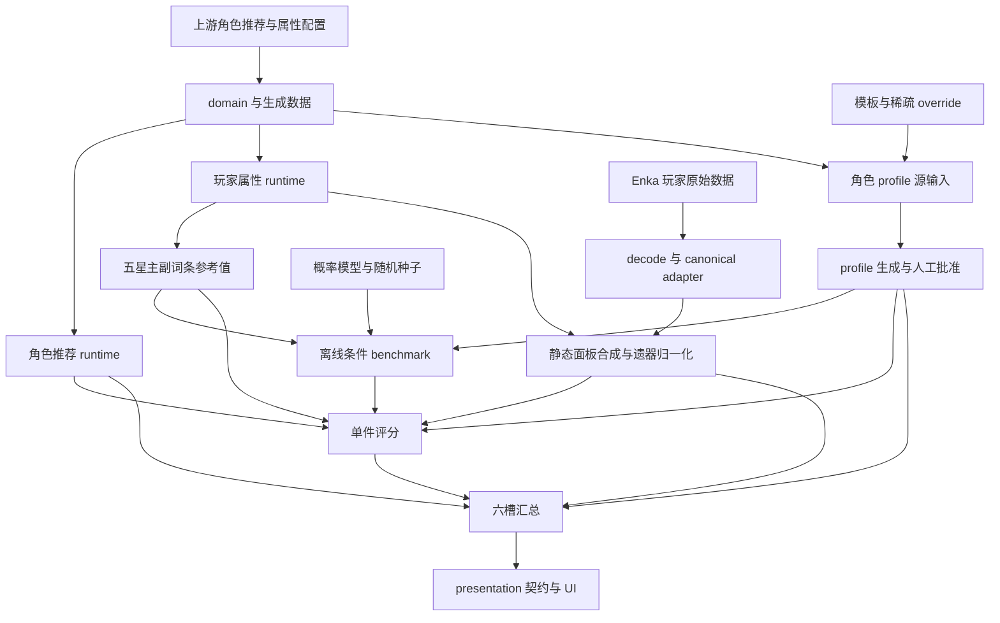

# 现有遗器评分实现：完整模型调查

调查日期：2026-10-01。调查对象：本地 `HSR-Database` 的 `develop` 分支，HEAD `13a85063d9b494b8dc7d8ea045c59824f4eb1879`。

本报告描述该快照实际执行的模型，包括数据生成、输入解析、面板合成、评分 profile、随机参照分布、单件评分、总分、失败状态和展示。它是对上一份主词条扩充可行性调查的补充；其中提出的 `addAccepted`、`agnosticSlots` 和 0.25/0.75 尚未实施。当前实现仍为严格上游主词条白名单和 0.35/0.65。

调查只读：没有修改生产代码、配置、测试、上游数据或已有报告；没有生成/批准 profile，没有重新生成 benchmark，也没有调用外部 API。最终新增产物仅为本报告。临时计算通过 Node 标准输入运行，不保留分析脚本。

## 1. 模型概览与结论

现有评分器是一个有数据有效性前置条件的、确定性的分层评价函数：

1. 从 Enka 的装备 ID、词条 ID、出现次数和累计档位重建未经展示取整的遗器数值，并合成静态非战斗面板。
2. 使用已人工批准的角色 profile，把副词条换算成“加权五星高档词条当量”原始效用。
3. 用“同角色、同槽位、同实际主词条，三件自然五星全部强化到 +15 后选副词条效用最高者”的模拟分布，把原始效用换算为 percentile。
4. 单件评分由主词条适配及数值完成度占 35%、副词条 percentile 占 65% 构成。
5. 六槽加权汇总后，把 soft target 完成度和 hard breakpoint 达标比例加入属性维度的加权平均；属性维度占总分 95%，套装结构占 5%。

因此它不是伤害计算、实战收益、最优配装、玩家群体排名或体力投入回报模型。它衡量的是：在当前推荐、权重及自然遗器随机参照模型下，一套装备的相对完成度。

需要特别区分四个量：原始副词条效用可以超过 1；percentile 在 [0,1]；单件分数在 [0,100]；build 总分还会受六槽权重、目标和套装影响。“有效命中次数”是另一个按上游推荐计数的展示指标，不参与上述评分公式。

## 2. 调查基线与证据定位

### 2.1 快照与产物

| 对象 | 本地调查值 |
| --- | --- |
| 网站 HEAD | `13a85063d9b494b8dc7d8ea045c59824f4eb1879` |
| `TurnBasedGameData` HEAD / lock | `df3aa4ad71806bd083b1a0ddc938f5aa95c4933e` |
| `StarRailRes` HEAD / lock | `dbe8cdfcfb0bf657b9fe1cf92d5537f118ccb487` |
| generated data manifest | schema 47，gameVersion 4.6，sourceCommit `6b2bc17ebf461e497ba0dd0ffd44875f1866762b` |
| generated profiles | schema 3，generator 3，98 个，全部 reviewed |
| profiles provenance sourceCommit | `8b178dd48698e5e7b12f0cc319ddab149f2ffc5c` |
| production benchmark | schema 3，98 × 28 = 2,744 个条件分布 |
| benchmark version | `lens-b-main-conditioned-v2` |
| benchmark generator version | `lens-b-production-main-conditioned-v2` |
| production benchmark 文件 SHA-256 | `bedf7579503c7bb1f49662ad1bdea69ccba1b506ebd6b9d4306e45210f580cd9` |

不同 provenance commit 字符串不能直接当作语义过期的证据。profile 校验会按当前输入重建语义并比较；其比较不要求历史 `sourceCommit` 等于当前 checkout。benchmark 则按评分依赖 digest 校验。上述数值描述本地快照，不声称反映在线最新游戏状态。

### 2.2 核心代码索引

以下链接指向本次调查的实际本地文件。后文用文件名和 symbol 引用这些位置。

| 层 | 代码、配置与关键入口 |
| --- | --- |
| 架构约束 | [AGENTS.md](C:/Users/unkn0/Documents/Projects/HSR-Database-Project/HSR-Database/AGENTS.md)、[localization-and-data-generation.md](C:/Users/unkn0/Documents/Projects/HSR-Database-Project/HSR-Database/docs/architecture/localization-and-data-generation.md) |
| 上游来源合并 | [character-sources.ts](C:/Users/unkn0/Documents/Projects/HSR-Database-Project/HSR-Database/scripts/data/character-sources.ts)：`mergeConfigSources`；[raw.ts](C:/Users/unkn0/Documents/Projects/HSR-Database-Project/HSR-Database/scripts/data/raw.ts) |
| 角色 domain / projection | [domain/character.ts](C:/Users/unkn0/Documents/Projects/HSR-Database-Project/HSR-Database/scripts/data/domain/character.ts)：`buildCharacterDomain`；[projection/character.ts](C:/Users/unkn0/Documents/Projects/HSR-Database-Project/HSR-Database/scripts/data/projection/character.ts)：`projectCharacterView` |
| 数据与 runtime 生成 | [sync.ts](C:/Users/unkn0/Documents/Projects/HSR-Database-Project/HSR-Database/scripts/data/sync.ts)、[player-runtime.ts](C:/Users/unkn0/Documents/Projects/HSR-Database-Project/HSR-Database/scripts/data/player-runtime.ts)、[upstream.lock.json](C:/Users/unkn0/Documents/Projects/HSR-Database-Project/HSR-Database/upstream.lock.json) |
| Profile 源配置 | [profile-templates.json](C:/Users/unkn0/Documents/Projects/HSR-Database-Project/HSR-Database/data/relic-score/profile-templates.json)、[profile-overrides.json](C:/Users/unkn0/Documents/Projects/HSR-Database-Project/HSR-Database/data/relic-score/profile-overrides.json) |
| Profile 生成与审批 | [profiles.ts](C:/Users/unkn0/Documents/Projects/HSR-Database-Project/HSR-Database/scripts/relic-score/profiles.ts)、[validate.ts](C:/Users/unkn0/Documents/Projects/HSR-Database-Project/HSR-Database/scripts/relic-score/validate.ts)、[review-core.ts](C:/Users/unkn0/Documents/Projects/HSR-Database-Project/HSR-Database/scripts/relic-score/review-core.ts) |
| Profile 类型 / 产物 | [profile-types.ts](C:/Users/unkn0/Documents/Projects/HSR-Database-Project/HSR-Database/src/lib/relic-score/profile-types.ts)、[character-profiles.json](C:/Users/unkn0/Documents/Projects/HSR-Database-Project/HSR-Database/src/lib/relic-score/generated/character-profiles.json) |
| Enka 解析、适配、流水线 | [decode.ts](C:/Users/unkn0/Documents/Projects/HSR-Database-Project/HSR-Database/api/_player/enka/decode.ts)、[adapter.ts](C:/Users/unkn0/Documents/Projects/HSR-Database-Project/HSR-Database/api/_player/enka/adapter.ts)、[pipeline.ts](C:/Users/unkn0/Documents/Projects/HSR-Database-Project/HSR-Database/api/_player/enka/pipeline.ts) |
| 玩家数据契约 | [canonical.ts](C:/Users/unkn0/Documents/Projects/HSR-Database-Project/HSR-Database/src/lib/player/canonical.ts)、[runtime-data.ts](C:/Users/unkn0/Documents/Projects/HSR-Database-Project/HSR-Database/src/lib/player/runtime-data.ts) |
| 面板合成 / 属性语义 | [stat-synthesis.ts](C:/Users/unkn0/Documents/Projects/HSR-Database-Project/HSR-Database/src/lib/player/stat-synthesis.ts)、[property-semantics.ts](C:/Users/unkn0/Documents/Projects/HSR-Database-Project/HSR-Database/src/lib/player/property-semantics.ts) |
| 推荐 / stat registry / 参考值 | [recommendations.ts](C:/Users/unkn0/Documents/Projects/HSR-Database-Project/HSR-Database/src/lib/relic-score/recommendations.ts)、[stat-registry.ts](C:/Users/unkn0/Documents/Projects/HSR-Database-Project/HSR-Database/src/lib/relic-score/stat-registry.ts)、[reference.ts](C:/Users/unkn0/Documents/Projects/HSR-Database-Project/HSR-Database/src/lib/relic-score/reference.ts) |
| 归一化 / 评分输入类型 | [normalize.ts](C:/Users/unkn0/Documents/Projects/HSR-Database-Project/HSR-Database/src/lib/relic-score/normalize.ts)：`normalizePlayerBuildInput`；[types.ts](C:/Users/unkn0/Documents/Projects/HSR-Database-Project/HSR-Database/src/lib/relic-score/types.ts) |
| 评分常量 / 数学 / 实现 | [scoring-config.ts](C:/Users/unkn0/Documents/Projects/HSR-Database-Project/HSR-Database/src/lib/relic-score/scoring-config.ts)、[scoring-math.ts](C:/Users/unkn0/Documents/Projects/HSR-Database-Project/HSR-Database/src/lib/relic-score/scoring-math.ts)、[score.ts](C:/Users/unkn0/Documents/Projects/HSR-Database-Project/HSR-Database/src/lib/relic-score/score.ts) |
| 自然遗器概率配置 / 编译 | [probability-model.json](C:/Users/unkn0/Documents/Projects/HSR-Database-Project/HSR-Database/data/relic-score/probability-model.json)、[probability-model.ts](C:/Users/unkn0/Documents/Projects/HSR-Database-Project/HSR-Database/src/lib/relic-score/farming/probability-model.ts) |
| 自然遗器生成 / PRNG | [generate-natural-relic.ts](C:/Users/unkn0/Documents/Projects/HSR-Database-Project/HSR-Database/src/lib/relic-score/farming/generate-natural-relic.ts)、[prng.ts](C:/Users/unkn0/Documents/Projects/HSR-Database-Project/HSR-Database/src/lib/relic-score/farming/prng.ts) |
| 选择 / 分位数编码 | [prototype.ts](C:/Users/unkn0/Documents/Projects/HSR-Database-Project/HSR-Database/src/lib/relic-score/farming/prototype.ts)、[dense-quantile.ts](C:/Users/unkn0/Documents/Projects/HSR-Database-Project/HSR-Database/src/lib/relic-score/farming/dense-quantile.ts) |
| Benchmark 身份 / 校验 / CDF | [identity.ts](C:/Users/unkn0/Documents/Projects/HSR-Database-Project/HSR-Database/src/lib/relic-score/benchmark/identity.ts)、[validate.ts](C:/Users/unkn0/Documents/Projects/HSR-Database-Project/HSR-Database/src/lib/relic-score/benchmark/validate.ts)、[cdf.ts](C:/Users/unkn0/Documents/Projects/HSR-Database-Project/HSR-Database/src/lib/relic-score/benchmark/cdf.ts)、[lookup.ts](C:/Users/unkn0/Documents/Projects/HSR-Database-Project/HSR-Database/src/lib/relic-score/benchmark/lookup.ts) |
| Benchmark 生成 / 产物 / 审计 | [benchmark-core.ts](C:/Users/unkn0/Documents/Projects/HSR-Database-Project/HSR-Database/scripts/relic-score/benchmark-core.ts)、[benchmark-production.ts](C:/Users/unkn0/Documents/Projects/HSR-Database-Project/HSR-Database/scripts/relic-score/benchmark-production.ts)、[farming-benchmarks.json](C:/Users/unkn0/Documents/Projects/HSR-Database-Project/HSR-Database/src/lib/relic-score/generated/farming-benchmarks.json)、[generation-audit.json](C:/Users/unkn0/Documents/Projects/HSR-Database-Project/HSR-Database/docs/relic-score-feature/phase-1e-benchmark-generation-audit.json) |
| 服务端评分 | [benchmark-loader.ts](C:/Users/unkn0/Documents/Projects/HSR-Database-Project/HSR-Database/src/lib/server/relic-score/benchmark-loader.ts)、[server/score.ts](C:/Users/unkn0/Documents/Projects/HSR-Database-Project/HSR-Database/src/lib/server/relic-score/score.ts)、[server/player.ts](C:/Users/unkn0/Documents/Projects/HSR-Database-Project/HSR-Database/src/lib/server/relic-score/player.ts) |
| Presentation / API 契约 | [presentation.ts](C:/Users/unkn0/Documents/Projects/HSR-Database-Project/HSR-Database/src/lib/relic-score/presentation.ts)、[relic-score-contract.ts](C:/Users/unkn0/Documents/Projects/HSR-Database-Project/HSR-Database/src/lib/player/relic-score-contract.ts)、[relic-score-presentation.ts](C:/Users/unkn0/Documents/Projects/HSR-Database-Project/HSR-Database/src/lib/player/relic-score-presentation.ts) |
| UI | [PlayerRelicCard.svelte](C:/Users/unkn0/Documents/Projects/HSR-Database-Project/HSR-Database/src/lib/components/player/PlayerRelicCard.svelte)、[PlayerRelicScoreSummary.svelte](C:/Users/unkn0/Documents/Projects/HSR-Database-Project/HSR-Database/src/lib/components/player/PlayerRelicScoreSummary.svelte)、[PlayerAffixRow.svelte](C:/Users/unkn0/Documents/Projects/HSR-Database-Project/HSR-Database/src/lib/components/player/PlayerAffixRow.svelte) |

历史 phase 报告有助于理解选型，但当前代码和配置优先。特别是 target 数量应以本次快照统计为准，不能照搬旧维护文档的数字。

## 3. 完整数据流和依赖关系



运行时单件评分需要 `ScoringSources` 中的 profile、recommendation、reference、benchmark 和 expected identity。推荐不是 generated profile 的字段，而是独立输入；profile 保存副词条权重、目标和审阅元数据。服务端消费打包产物，不读取 sibling filesystem，也不在线模拟遗器。

单件主词条匹配不读取玩家面板、另外五件装备、光锥、星魂或 hard/soft target。只有 build-level 目标评价读取合成面板。profile 的生成历史会使用上游推荐主词条帮助消歧 scaling stat，这与运行时单件读取目标是两件不同的事。

## 4. 上游推荐、槽位与统一属性标识

### 4.1 推荐生成

数据来源是 `TurnBasedGameData/ExcelOutput/AvatarRelicRecommend.json` 与对应 LD 配置。`mergeConfigSources` 按 `AvatarID` 合并；完全相同的重复项可以去重，有冲突的重复项会报错。不能只查普通表：1014、1015、1508、1509 的覆盖需要 LD 来源。

`buildCharacterDomain` 从合并表提取：

| 上游字段 | 内部语义 |
| --- | --- |
| `AvatarID` | `avatarId` / `characterId` |
| `PropertyList3` | BODY 推荐主词条 |
| `PropertyList4` | FOOT 推荐主词条 |
| `PropertyList5` | NECK 推荐主词条 |
| `PropertyList6` | OBJECT 推荐主词条 |
| `SubAffixPropertyList` | 推荐副词条 key 集合 |
| `Set4IDList` | 推荐外圈四件套 ID |
| `Set2IDList` | 推荐内圈二件套 ID |

projection 将 domain ID 写入推荐的 `avatarId`。同步产生各语言角色 detail，以及不依赖语言的 `runtime/relic-score-recommendations.json`。profile 维护 loader 读取 generated 角色输入，运行时读取独立推荐 runtime。

`assertRelicScoreRecommendations` 校验契约结构、ID、四个不同的可变主词条槽位和字符串数组；profile 配置验证进一步检查合法 key、slot 合法性、非空集合及重复项。raw parser 使用 lossless JSON 保持 TextMap hash 为十进制字符串；评分用稳定 ID/key，不以中文名匹配。

### 4.2 槽位与主词条合法域

registry 有 21 个 `RelicStatKey`，其中 12 个可作副词条。六槽主词条组合总数为 28。

| 编号 / key | 部位 | 合法主词条 |
| --- | --- | --- |
| 1 / HEAD | 头部 | `HPDelta` |
| 2 / HAND | 手部 | `AttackDelta` |
| 3 / BODY | 躯干 | HP%、ATK%、DEF%、CR、CD、治疗量、EHR |
| 4 / FOOT | 脚部 | HP%、ATK%、DEF%、SPD |
| 5 / NECK | 位面球 | HP%、ATK%、DEF%、七种属性伤害 |
| 6 / OBJECT | 连结绳 | HP%、ATK%、DEF%、BE、ERR |

| 属性 | 主副词条统一 key | 面板目标 | 可作副词条 |
| --- | --- | --- | --- |
| 固定生命 / 百分比生命 | `HPDelta` / `HPAddedRatio` | `hp` | 都可以 |
| 固定攻击 / 百分比攻击 | `AttackDelta` / `AttackAddedRatio` | `atk` | 都可以 |
| 固定防御 / 百分比防御 | `DefenceDelta` / `DefenceAddedRatio` | `def` | 都可以 |
| 速度 | `SpeedDelta` | `spd` | 是 |
| 暴击率 / 暴击伤害 | `CriticalChanceBase` / `CriticalDamageBase` | `crit_rate` / `crit_dmg` | 是 |
| 效果命中 / 效果抵抗 | `StatusProbabilityBase` / `StatusResistanceBase` | `effect_hit` / `effect_res` | 是 |
| 击破特攻 | `BreakDamageAddedRatioBase` | `break_dmg` | 是 |
| 能量恢复效率 | `SPRatioBase` | `sp_rate` | 否 |
| 治疗量加成 | `HealRatioBase` | `heal_rate` | 否 |
| 七种属性伤害 | `PhysicalAddedRatio`、`FireAddedRatio`、`IceAddedRatio`、`ThunderAddedRatio`、`WindAddedRatio`、`QuantumAddedRatio`、`ImaginaryAddedRatio` | 相应 `*_dmg` | 否 |

flat 和 percentage 的 key 不相等，即使最后落入同一个面板目标。抵抗没有合法主词条；固定防御没有合法主词条。`AllDamageTypeAddedRatio` 属于玩家属性语义中的单独 `all_dmg` 目标，当前合成器没有把它自动分摊给各属性伤害目标。

## 5. 输入重建与静态面板模型

### 5.1 Enka → canonical

decode 校验数字字段及槽位编号等结构。adapter 产生 `CanonicalPlayerRelic`：

```ts
{ tid, type, level, mainAffixId, subAffixes: [{ affixId, cnt, step? }] }
```

遗器等级缺省时 adapter 使用 0；副词条数组缺省为 []；累计 `step` 缺省在归一化时按 0 处理。角色 rank/promotion 缺省为 0。光锥叠影 rank 限定 1–5。这里的“缺省”指字段缺失，不能推广为任意 null/异常值都接受。

`buildId = area:${area}:position:${position ?? 'none'}:order:${sourceOrder}` 区分同角色的多个展示 build。评分 profile 按 `avatarId` 选择；`buildId` 只用于关联结果。`enhancedId` 等展示信息没有生成另一个评分 profile。

runtime 用遗器 `tid` 找 rarity、maxLevel、setId、main/sub affix group，再用 group 和 affix ID 找属性数据。评分不从界面四舍五入后的文本反推数值。

设主词条基础值为 \(a_{s,k}\)，每级增量为 \(d_{s,k}\)，等级为 \(\ell\)：

$$
x^{\mathrm{main}}_{s,k}(\ell)=a_{s,k}+\ell d_{s,k}.
$$

设副词条基础值 \(b_k\)、每档增量 \(\delta_k\)、出现次数 \(c_k\)、累计档位 \(t_k\)：

$$
x^{\mathrm{sub}}_k=b_kc_k+\delta_kt_k.
$$

`cnt` 包括初始出现和后续强化命中；`step` 是每次出现档位之和，不是一次强化的档位，也不是强化次数。当前 provider 的次数被归一化为 `rollCount: {status:'exact', count:cnt, source:'provider'}`。

### 5.2 属性贡献的来源

`collectPropertyContributions` 从以下配置收集静态数值：

| 来源 | 实际收集内容 |
| --- | --- |
| 角色 | 当前 promotion 的 HP/ATK/DEF 基础与成长：`base + add × (level−1)`；基础速度、CR、CD |
| 光锥 | 当前 promotion 的 HP/ATK/DEF；当前叠影的静态 `EquipmentSkillConfig.AbilityProperty` |
| 遗器 | 所有可解析的主副词条，使用前述原始数值公式 |
| 套装 | 件数达到 `required` 时，runtime 中相应静态 `RelicSetSkillConfig.PropertyList` |
| 行迹 | rawLevel > 0 且 `pointType === 1` 的静态 `StatusAddList` |

光锥可以缺席；如果存在却缺少 progression/ability 会产生诊断。collector 没有额外执行光锥命途适配过滤。达到套装件数时收集静态字段，并不执行描述文本中的战斗触发条件。

常规技能、条件型行迹、星魂机制、队友、敌人、战斗 buff、行动循环和技能倍率不会在这里模拟。星魂的技能等级提升通过 `effectiveTraceLevel` 影响展示等级，不等于对全部星魂效果进行面板/评分模拟。任一合成诊断都会使 synthesis 状态 failed，并不给出完整数值面板。

### 5.3 合成公式及单位

`PLAYER_PROPERTY_SEMANTICS` 将每个 property 映射为目标 \(p\) 和 bucket。令该目标的四个贡献和为 \(B_p,R_p,F_p,D_p\)，分别表示 base、ratio、flat、direct：

$$
P_p=
\begin{cases}
B_p(1+R_p)+F_p+D_p,&p\in\{hp,atk,def,spd\},\\
D_p+B_p+F_p,&\text{其他目标}.
\end{cases}
$$

比例采用 1 = 100%，例如 EHR 0.8 表示 80%。数值面板保留原始浮点数，格式化仅发生在 display。没有贡献的非核心属性可以根本不在 `values` 中；不能把缺失 target 自动解释为零。

目标 key 的语义尤其重要：profile 中 `AttackAddedRatio` 的 target 是最终 `atk`，阈值 3200 表示最终攻击力 3200，而不是 3200% 或攻击百分比 bucket。同理 `HPAddedRatio`/`DefenceAddedRatio` 的目标是最终生命/防御数值。

## 6. 输入归一化与可评分域

`normalizePlayerBuildInput` 输出 valid input，或 unavailable/invalid 携带 `partialInput` 和按 slot 的 `pieceFailures`。模型是部分函数：不满足条件时返回状态，不把错误伪装为 0 分。

### 6.1 单件守卫

| 检查 | 状态 / reason |
| --- | --- |
| 无 runtime 遗器身份 | unavailable / `UNKNOWN_RELIC` |
| provider slot 与身份不一致 | invalid / `SLOT_MISMATCH` |
| 身份 rarity/maxLevel 不是安全整数 | unavailable / `UNKNOWN_RARITY` |
| 等级不是安全整数或不在 0…maxLevel | invalid / `INVALID_LEVEL` |
| affix 数据缺失 | unavailable / `UNKNOWN_AFFIX` |
| 主词条 key 不支持或该 slot 不合法 | invalid / `INVALID_MAIN_STAT` |
| 副词条不可作为副词条 | invalid / `INVALID_SUBSTAT` |
| 主副词条同一 key | invalid / `MAIN_SUB_CONFLICT` |
| 重复副词条 key | invalid / `DUPLICATE_SUBSTAT` |
| cnt 非安全整数或 < 1 | invalid / `INVALID_ROLL_COUNT` |
| step 非安全整数或 < 0 | invalid / `INVALID_STEP` |
| 重建数值非有限或 ≤ 0 | unavailable / `NONFINITE_VALUE` |

归一化没有进一步验证副词条数量 ≤ 4、总出现次数符合 8/9、`step ≤ cnt × stepNum` 或完整强化历史可达性。它校验的是当前代码列出的结构与数值条件；不能把它描述为完整的伪造装备判定器。

### 6.2 Build 守卫和部分结果

合成失败先记录 buildFailure。成功合成后，panel key 必须已知且值有限，并必须有 `hp/atk/def/spd/crit_rate/crit_dmg` 六个核心目标。遗器继续独立归一化，重复 slot 记录 `DUPLICATE_SLOT` 并跳过重复项，缺 slot 记录 `MISSING_SLOT`。通常使用 `??=` 保留最先出现的 build 失败原因；全部 slot 失败仍可分别记录。

有效遗器按 HEAD、HAND、BODY、FOOT、NECK、OBJECT 排序。缺件或一件损坏不意味着其余单件全部丢失：`partialInput` 支持展示可计算的单件分，但总分不可用。

### 6.3 星级

本地 runtime 有 2★/3★/4★/5★，最大等级分别为 6/9/12/15；没有可核实的 1★身份覆盖。较低星级并不在此层一律拒绝，但评分参考值和 benchmark 始终用五星 +15，没有按星级重新定标。

因此低星级主词条用其实际值除以五星满级参考；其副词条也除以五星高档值，然后查询五星 +15 条件分布。未满级同理。它评价当前完成度，不预测这件遗器升满后的潜力。

## 7. 角色 profile 的生成、权重与审阅

### 7.1 配置契约

模板配置 schema 1；override 配置 schema 3；generated profile schema 3 / generator 3。`ProfileOverride` 的实际字段为：

```ts
{
  templateId?, scalingStat?, statWeights?,
  hardBreakpoints?, softTargets?, reviewedInputDigest?, note?
}
```

`scalingStat: null` 明确表示不选择 scaling stat。目标数组由 override 完整提供，缺省为 []，不是逐条累加或继承模板目标。`CharacterRelicScoreProfile` 包含 `characterId/templateId/substatWeights/hardBreakpoints/softTargets/metadata`；没有主词条 override 字段。

### 7.2 自动模板选择的完整优先级

令 CR、CD、BE、EHR、SPD、ATK% 表示相应 key 是否在上游推荐副词条中。`inferTemplate` 从上到下取首个条件：

| 条件 | 模板 |
| --- | --- |
| CR 且 CD 且 BE | `hybrid-direct-break` |
| CR 且 CD | `direct-dps` |
| BE 且既无 CR 也无 CD | `break` |
| EHR 且 ATK% | `dot-dps` |
| EHR 且 SPD | `debuff-support` |
| path 是 Knight 或 Priest | `sustain` |
| path 是 Shaman | `direct-support` |
| 其他 | `direct-dps` |

现有生成器确实有上述基于推荐和 path 的 heuristic。它只生成初始权重模板，最终必须审阅；这不意味着未来主词条扩充应该继续推导角色定位。

审阅原因包括：Memory/Elation → `SPECIAL_PATH`；仅 CR/CD 之一，或 BE+EHR → `MIXED_STAT_SIGNALS`；模板不符合 path prior → `PATH_TEMPLATE_MISMATCH`。prior 为 Warrior/Rogue/Mage 对应 direct/hybrid/break，Warlock 对应 dot/debuff/break/direct，Shaman 对应 direct-support，Knight/Priest 对应 sustain。confidence 是有 SPECIAL_PATH 则 low，否则有上述原因则 medium，否则 high。

override 的 `templateId` 优先于自动结果，但 metadata 仍保留自动推断的 confidence/reasons。`AMBIGUOUS_SCALING` 是随后追加的原因，不重新计算 confidence。

### 7.3 Scaling stat 与最终权重

`resolveScalingStat` 取推荐副词条中的 HP%、ATK%、DEF%：只有一个则选它；多个则看上游四槽主词条并集，只有一个候选被支持时选它；其他情况为 undefined。explicit override 的 scalingStat 优先，null 禁用。

令推荐副词条集合为 \(\mathcal R_c\)，选中模板为 \(T_c\)，scaling key 为 \(k_c^*\)。对 \(k\in\mathcal R_c\)，模板初值按以下“首个有定义值”确定：

$$
w^{(0)}_{c,k}=T_c[k]\ \mathbin{??}\
\bigl(k=k_c^*?T_c[\text{scaling-stat}]:\mathrm{undefined}\bigr)
\ \mathbin{??}\ T_c[\text{other-recommended}]\ \mathbin{??}\ 0.
$$

然后 apply `statWeights`：指定 0 则删除该 key，其他值覆盖。override 不能新增上游未推荐的副词条。最终只存正权重，运行时缺省 \(w_{c,k}=0\)。允许的权重为 `{0, 0.25, 0.5, 0.75, 1, 1.25}`；没有负权重、惩罚词条或特殊无限值。

| 模板 | 明确权重 | scaling-stat | other-recommended |
| --- | --- | --- | --- |
| direct-dps | CR 1.25，CD 1.25，SPD 0.75 | 1 | 0.25 |
| direct-support | SPD 1.25，CD 1，EHR 0.75，RES 0.5 | 0.75 | 0.5 |
| break | BE 1.25，SPD 1 | 0.75 | 0.25 |
| dot-dps | EHR 1，SPD 1 | 1.25 | 0.25 |
| debuff-support | EHR 1.25，SPD 1.25，RES 0.5 | 0.5 | 0.25 |
| sustain | SPD 1.25，RES 0.75 | 1 | 0.5 |
| hybrid-direct-break | BE 1.25，CR 1，CD 1，SPD 0.75 | 0.75 | 0.25 |

当前统计：direct-dps 53，sustain 13，direct-support 13，break 9，dot-dps 7，hybrid 3，debuff-support 0。confidence high/medium/low 分别 65/17/16；98 个 profile 均 reviewed。正权重共 353 项：1.25 有 122 项，1 有 103 项，0.75 有 90 项，0.5 有 31 项，0.25 有 7 项。当前上游推荐副词条均得到正权重，但配置机制允许以后关闭其中某项。

### 7.4 审阅状态与校验

`profileInputDigest` 是 stable serialization 后的 SHA-256，输入包括 schema/generator version、characterId、path、上游主副词条与套装推荐、所选模板 ID/内容、semantic override。对象 key 排序，数组顺序保留。名字、语言、note、历史 sourceCommit、reviewedInputDigest 本身不参与语义 digest。

有 reviewedInputDigest 且与当前 digest 相同 → reviewed；有但不同 → needs-review；没有且自动 high 且无 reason → unreviewed；其他 → needs-review。high confidence 不自动取得运行时评分资格。

validator 检查配置未知字段、孤儿角色 ID、冗余 override、权重枚举、推荐副词条限制、非空显式 target 数组、有限阈值等。soft 要求 maximum > minimum，同 stat 不能重复，CR soft target 禁止；hard 禁止相同 stat+threshold 重复，但允许同一 stat 的不同阈值。target 不要求属于推荐副词条。

`validateCurrentProfiles` 按当前源配置重建产物语义，校验覆盖、metadata 和正权重等。审批 `approveCurrentReview` 将当前输入 digest 写回指定 override，然后重新生成/验证；普通生成不会自动批准。运行时 `scorePiece` 只检查 reviewed 与两个 digest 相等，不自行重算全部上游输入；严格 freshness 依靠维护/CI 数据校验链。

## 8. 五星参考值与原始副词条效用

### 8.1 参考值的构造

`buildRelicScoreReferenceData` 从 runtime 五星身份和 affix group 构造参考；检查同槽位主词条数据一致，并使用共同五星副词条组及合法 StepNum。

$$
m_{s,k}^{15}=a_{s,k}+15d_{s,k},\qquad h_k=b_k+D_k\delta_k,
$$

其中 \(D_k\) 是最高单次档位 `stepNum`，当前全部为 2。\(h_k\) 是一次最高档出现的值，而不是一整件遗器的最高可能值。

五星主词条参考值如下，表中作小数展示；运行时使用原始浮点计算结果：

| 主词条 | 五星 +15 参考 |
| --- | --- |
| HEAD 固定生命 | 705.6 |
| HAND 固定攻击 | 352.8 |
| HP%、ATK%、EHR | 0.432 |
| DEF% | 约 0.540000015 |
| SPD | 25.032 |
| CR / CD | 0.324 / 0.648 |
| 治疗量 | 0.345606 |
| 七种属性伤害 | 约 0.388803015 |
| BE | 0.648 |
| ERR | 约 0.194394015 |

| 副词条 | \(b_k\) | \(\delta_k\) | \(h_k\)，近似展示 |
| --- | --- | --- | --- |
| HPDelta | 33.87004 | 4.233755 | 42.33755 |
| AttackDelta / DefenceDelta | 16.935019 | 2.116877 | 21.168773 |
| HP% / ATK% / EHR / RES | 0.034560002 | 0.0043200003 | 0.0432000026 |
| DEF% | 0.0432 | 0.0054 | 0.054 |
| SPD | 2 | 0.3 | 2.6 |
| CR | 0.02592 | 0.0032400002 | 0.0324000004 |
| CD / BE | 0.05184 | 0.0064800004 | 0.0648000008 |

### 8.2 加权高档词条当量

对角色 \(c\) 和单件 \(r\)，定义：

$$
e_{r,k}=\frac{x^{\mathrm{sub}}_{r,k}}{h_k},\qquad
U_c(r)=\sum_{k\in\operatorname{substats}(r)}w_{c,k}e_{r,k}.
$$

这是 `scorePiece` 的 `rollEq`、`weightedContribution` 和 `rawSubUtility`。每个非推荐/无权重词条贡献 0，但仍必须有合法的高档参考值。次数和档位先影响实际数值，再间接影响效用；公式不直接加 `cnt`。

同一次出现的低档和高档效用不同。速度最低档当量为 2/2.6 ≈ 0.76923，最高档为 1；其他词条三档近似 0.8/0.9/1。IEEE-754 以及上游增量精度会带来微小差异，不应在中间阶段人为取整。

## 9. 自然遗器随机生成的完整概率模型

当前概率模型 schema 1 / `natural-5star-v1`。主词条概率和副词条选择权重是维护者批准的 wiki 转录配置；合法属性及数值来自上游。它们是本地模型的输入，不是本次独立验证过的游戏随机机制。

### 9.1 主词条概率

| Slot | 非零概率 |
| --- | --- |
| HEAD / HAND | 固定主词条，1 |
| BODY | HP%、ATK%、DEF% 各 0.20；CR、CD、EHR、治疗量各 0.10 |
| FOOT | HP% 0.28，ATK% 0.30，DEF% 0.30，SPD 0.12 |
| NECK | HP% 0.12，ATK% 0.13，DEF% 0.12；七种属性伤害各 0.09 |
| OBJECT | HP% 0.26，ATK% 0.27，DEF% 0.26，BE 0.16，ERR 0.05 |

自然 mixture 诊断会按上述概率抽主词条；生产 benchmark 则固定实际主词条，没有这次抽样，也不消耗这次 RNG。生产参照因此不把主词条稀有度转换成评分或获取成本。

### 9.2 副词条类型选择

初始 pool 是 12 种合法副词条，移除与主词条相同的 key。各词条选择权重：

| 类型 | 每项权重 |
| --- | --- |
| 固定 HP/ATK/DEF，百分比 HP/ATK/DEF | 10 |
| EHR、RES、BE | 8 |
| CR、CD | 6 |
| SPD | 4 |

未排除时总权重为 100。每次 reveal 在剩余集合 \(A\) 中按

$$
\Pr(k\mid A)=v_k/\sum_{j\in A}v_j
$$

抽取，然后移除已选类型，属于顺序加权无放回抽样，不是各副词条独立出现。百分比 HP 和固定 HP 是不同 key；HP% 主词条只排除 HP%，仍可出现固定 HP。

### 9.3 初始数量、档位与强化

初始四词条概率 0.2，三词条概率 0.8。每次 reveal 或强化命中独立抽单次档位：

$$
g_k=\lfloor u(D_k+1)\rfloor,\quad u\in[0,1),
$$

即当前 0/1/2 等概率。初始每条 `cnt=1, step=g`。强化节点为 +3/+6/+9/+12/+15：三词条起始在 +3 reveal 第四条；其他节点等概率选一条已存在副词条，`cnt += 1, step += g`。

所有模拟结果均强化到 +15，无停损筛选、定向强化、重铸或中途丢弃。最终四种副词条各不相同；三词条起始总出现次数 8，四词条起始为 9。生成器不生成具体 setId/relicId，因为原始副词条效用与套装无关。

### 9.4 可复现随机序列

PRNG 为 `mulberry32-v1`，seed 为 123456789。等价更新为：

```ts
state = (state + 0x6d2b79f5) >>> 0;
let t = state;
t = Math.imul(t ^ (t >>> 15), t | 1);
t ^= t + Math.imul(t ^ (t >>> 7), t | 61);
const u = ((t ^ (t >>> 14)) >>> 0) / 2 ** 32;
```

每个角色/slot/main 分布重新从相同 seed 开始，分布内部连续消费 RNG。数组顺序、是否抽主词条、是否 reveal 都会影响消费顺序。同 seed 的跨分布结果有配对相关性，不是彼此独立的 Monte Carlo 实验集合。

### 9.5 等价的联合分布表达

把 RNG 理想化为独立均匀变量，可以把上述生成程序写成一个完整的离散联合模型。该表达用于理解程序的概率目标；实际产物仍由固定 seed 的有限序列决定。

设排除主词条后的 pool 为 \(\mathcal K_m\)，最终 reveal 顺序为四个不同 key \((k_1,k_2,k_3,k_4)\)。它们的有序联合概率为：

$$
\Pr(k_1,k_2,k_3,k_4\mid m)=
\prod_{j=1}^{4}\frac{v_{k_j}}
{\sum_{k\in\mathcal K_m\setminus\{k_1,\ldots,k_{j-1}\}}v_k}.
$$

令初始数量 \(J\in\{3,4\}\)，\(\Pr(J=3)=0.8\)。第四条 reveal 后，尚有 \(L=J+1\) 次等概率强化，即 L=4 或 5。条件于最终四个 key 和 J，令强化命中向量 \((n_1,\ldots,n_4)\sim\operatorname{Multinomial}(L;1/4,1/4,1/4,1/4)\)，则：

$$
c_i=1+n_i,\qquad
\Pr(n_1,\ldots,n_4\mid J)=\frac{L!}{\prod_i n_i!}4^{-L},\qquad
t_i=\sum_{h=1}^{c_i}g_{i,h}.
$$

当前每个 \(g_{i,h}\) 在 0/1/2 中等概率。条件于 \(c_i\)，累计档位的概率生成函数为 \(\mathbb E[z^{t_i}\mid c_i]=((1+z+z^2)/3)^{c_i}\)。将 \((c_i,t_i)\) 代回副词条数值公式，即得 U 的完整离散分布；生产选择 Monte Carlo 近似而未枚举该分布。

由此可推导（不是额外配置）：总出现次数期望为 8.2；每个已选 key 的出现次数期望为 2.05；条件于 cnt，每条累计 step 期望为 cnt。合法模拟样本有 \(U\le9\max_k w_{c,k}\)，当前允许最高权重 1.25 时上界为 11.25。这个界不适用于未经完整强化历史约束的任意外部输入。

`compileProbabilityModel` 在生成前校验四槽概率覆盖与和为 1、固定槽唯一主词条、五星副词条组唯一、类型/权重完整覆盖且无重复、基础值与增量为正、StepNum 合法、初始概率和为 1、强化/档位 policy 与 provenance 类别等。模型闭包由 runtime 与配置共同约束，不能在 probability 文件中添加一个 runtime 不认识的词条。

## 10. 条件 benchmark 与 percentile 的精确定义

### 10.1 三件择优实验

生产预算 `N=3`，实验次数 `K=65,536`，Lens B。对每个合法 \((c,s,m)\)，每次实验生成三件同槽位、同固定主词条的五星 +15 遗器：

$$
Y_i=\max_{j=1,2,3}U_c(R_{i,j}\mid s,m),\quad i=1,\ldots,K.
$$

Lens B 只以原始副词条效用选最高者，不按主词条推荐过滤，也不按最终单件分选最高者。因为已固定主词条，未推荐但合法的主词条同样有分布。生产包含每角色全部 28 个主词条组合，共 2,744 个分布。

理想独立模型中，令单件效用 CDF 为 \(F_{c,s,m}\)，三件择优 CDF 为：

$$
G_{c,s,m}(u)=F_{c,s,m}(u)^3.
$$

生产保存其 Monte Carlo 近似，不是解析精确 \(F^3\)。这个关系说明：三件择优的 50th percentile 约对应单件的 79.37th percentile，90th 约对应单件的 96.55th；显示 50% 不等于“超过半数单件自然遗器”。

预算单位是目标槽位自然遗器件数，且已条件化实际主词条。它不是“三次副本掉落”“三件任意主词条中恰好符合条件”或真实体力预算。

### 10.2 257 点分位数编码

排序实验结果为 \(y_0\le\cdots\le y_{K-1}\)。对 \(p\in[0,1]\)，令 \(z=p(K-1),a=\lfloor z\rfloor,b=\min(a+1,K-1)\)：

$$
Q(p)=y_a+(y_b-y_a)(z-a),\qquad q_j=Q(j/256),\ j=0,\ldots,256.
$$

运行时 `lookupDenseCdf` 查询 \(U\)：

$$
\widehat G(U)=
\begin{cases}
0,&U<q_0,\\
1,&U\ge q_{256},\\
\displaystyle\frac{j+(U-q_j)/(q_{j+1}-q_j)}{256},&\text{其他},
\end{cases}
$$

其中 \(j=\max\{j:q_j\le U\}\)，取相等 knots 中最右一个。这个选择确保 ties 右连续且分母为正；不能取第一个等值 knot。`lookupBenchmarkPercentile` 再限幅到 [0,1]。

\(U=0\) 不保证 percentile 为 0：如果 q0 之后仍有连续零 knots，查询会跳到最右的零。一般退化情况下所有 knots 都等于零，则查询零直接返回 1；这是 CDF 函数的端点行为，不是“零词条奖励规则”。

### 10.3 表示误差与生成 gate

保存样本的精确经验 CDF 为：

$$
G_K(u)=K^{-1}\sum_{i=1}^{K}\mathbf1\{Y_i\le u\}.
$$

`measureQuantileError` 查询每个唯一观察值及相邻不同观察值的中点，比较 \(\widehat G\) 与 \(G_K\)。最大绝对误差 gate 为 0.005。若 257 点失败，计算 513 点诊断并报错，不自动发布 513 点，也不在运行时自动回退旧 benchmark。

当前存储 generation audit：2,744 个分布全部通过，max absolute CDF error 为 0.00390625，mean absolute CDF error 汇总为约 0.0007253273，最差分布为 `1005:BODY:HealRatioBase`。本次核对 audit 与产物文件 hash，没有重跑全部 Monte Carlo。

该 gate 测量有限查询集上的**表示压缩误差**，不等于 Monte Carlo 对真实分布的采样误差，也不构成真实游戏概率正确性或任意实数查询的统计置信界。以 gate 值计算，在这些受测查询上 percentile 对单件分的误差贡献最多 `100 × 0.65 × 0.005 = 0.325` 分；当前记录最大误差对应约 0.25390625 分。

artifact 的 mean/p25/p50/p75/p90/p95/p99 等 summary 用于审计，在线 percentile 查询只读 quantiles。

## 11. 单件评分：完整数学表达与守卫

### 11.1 主词条完成度

令 \(\mathcal A_{c,s}\) 为上游该槽推荐主词条集合；HEAD/HAND 则用 reference 中合法固定主词条集合。定义：

$$
I_{c,s,m}=\mathbf1\{m\in\mathcal A_{c,s}\},\qquad
M_c(r)=I_{c,s,m}\operatorname{clip}_{[0,1]}
\left(\frac{x^{\mathrm{main}}_r}{m_{s,m}^{15}}\right).
$$

主词条 suitability 只有 0/1；连续部分来自实际主词条数值相对五星满级数值的完成度。合法但未推荐主词条仍然可以评分，只令 M=0。

当前没有读取正副词条权重来扩充 accepted，也没有 agnostic 或 explicit addAccepted。ERR、治疗和属性伤害只有上游推荐时才取得主词条部分。

### 11.2 Percentile 与单件分

$$
P_c(r)=\widehat G_{c,s,m}(U_c(r)),\qquad
r_c(r)=0.35M_c(r)+0.65P_c(r),\qquad
R_c(r)=100r_c(r).
$$

对应字段分别为 `benchmarkPercentile`、`pieceNormalized`、`pieceScore`。五星 +15 推荐主词条：`R=35+65P`；不匹配：`R=65P`；未满主词条：`R=35×实际/参考+65P`。因此在固定 P 的比较中，满级匹配/不匹配差 35 分，匹配下限 35，错配上限 65。

但现实更换主词条时通常 P 也变：主词条改变排除的副词条 key 和参照分布，选择 \(\widehat G_{c,s,m}\) 的 m 来自实际主词条，不来自推荐集合。不能把任意两件不同主词条的分差简单写为 35 分。

`pieceNormalized` 使用 mainShare 和 `1-mainShare`；build 聚合分别读 mainShare/subShare，配置验证要求二者之和为 1。这两个入口目前等价，修改常量时必须保持一致。

### 11.3 ScorePiece 前置条件顺序

1. profile 存在、角色 ID 一致、reviewStatus 为 reviewed、inputDigest 等于 reviewedInputDigest，否则 `PROFILE_MISSING_OR_UNREVIEWED`。
2. recommendation 存在且 avatarId 一致，否则 `RECOMMENDATION_MISSING`。
3. slot 合法，主副词条值有限且非负，主词条 reference 和各副词条 high reference 存在且为正，效用有限；不符合则 invalid / `PIECE_INVALID`。
4. benchmark 和 expected 存在且校验通过，实际 `characterId/slot/mainKey` 条件分布存在且 identity 一致，否则 `BENCHMARK_MISSING_OR_STALE`。
5. 执行 CDF 和分数计算。

`scorePiece` 接受已归一化输入，不再次执行 rarity/level、重复词条、主副冲突、cnt/step 和强化历史等全部检查。其直接数值守卫允许零，而 provider 归一化重建词条值要求大于零。服务端 loader 完整校验后才可设置 `benchmarkValidated`，避免每件重复扫描全部 artifact；即便设置，仍检查实际分布 identity。

## 12. 六槽聚合、目标和套装总分

### 12.1 六槽基础属性完成度

槽位权重为 \(a_{HEAD}=a_{HAND}=0.1\)，其他四槽各 0.2，合计 1：

$$
B_M=\sum_s a_s\,0.35M_s,\quad
B_P=\sum_s a_s\,0.65P_s,\quad
B=B_M+B_P=\sum_s a_sr_s.
$$

`statCompletion.base=B`；`aggregatedMainPart=B_M`，`aggregatedSubPart=B_P`。它不是六件分数的算术平均，也不是全体原始效用求和后只查一次 CDF。各槽先做自己的条件 percentile，再聚合。

### 12.2 Soft target

对第 i 项 \((k_i,L_i,H_i)\)，读取属性语义对应的最终面板 \(P_{p(k_i)}\)：

$$
g_i=\operatorname{clip}_{[0,1]}\left(\frac{P_{p(k_i)}-L_i}{H_i-L_i}\right),\qquad
G=\begin{cases}\frac1{n_S}\sum_i g_i,&n_S>0,\\0,&n_S=0.\end{cases}
$$

到 minimum 进度为 0，到 maximum 为 1，中间线性；多项等权平均。缺目标面板值或非有限值返回 `PANEL_MISSING`。soft target 不给某一件遗器“达标归因”，也不改变单件 U、P 或主词条匹配。

### 12.3 Hard breakpoint

对第 j 项 \((k_j,t_j)\)：

$$
b_j=\mathbf1\{P_{p(k_j)}\ge t_j\},\qquad
f=\begin{cases}\frac1{n_H}\sum_j(1-b_j),&n_H>0,\\0,&n_H=0.\end{cases}
$$

等于阈值即通过；多项按失败项比例评价。`hardBreakpointFailureRatio=f`。它不是直接把总分乘以某个惩罚因子。相同属性不同阈值允许形成多个阶梯项。

### 12.4 目标修正后的属性维度

令 \(I_S=\mathbf1\{n_S>0\},I_H=\mathbf1\{n_H>0\}\)，则：

$$
Z=95+8I_S+5I_H,\qquad
A=\frac{95B+8I_SG+5I_H(1-f)}{Z}.
$$

`statCompletion.normalized=A`。没有 target 时 A=B；存在 soft/hard 时，把相应的完成度/达标项加入平均并重新归一化。不存在的 target 不占分母权重。

因此 soft target 不是必然加分：G<B 时它拉低属性维度；已过 hard 在 B<1 时拉高，失败 hard 则拉低。这是绝对完成度加权，不是先算总分再扣固定分。

### 12.5 套装结构

`evaluateSetIntegrity` 只按 setId 件数和上游推荐 ID 评价结构：

| 外圈四件结构 | \(C\) |
| --- | --- |
| 推荐同套四件 | 1 |
| 非推荐同套四件 | 0.8 |
| 两个二件套 | 0.5 |
| 只有一个二件组合，包括 3+1 | 0.2 |
| 没有二件组合 | 0 |

两个二件套或一个二件组合不按推荐套装额外加权。内圈两件同套且推荐 \(J=1\)，同套非推荐 \(J=0.5\)，混搭 \(J=0\)。

$$
T=\frac23C+\frac13J.
$$

`matchedCavernSetId/matchedPlanarSetId` 仅在完整同套且推荐时有值。套装评分不使用套装战斗效果，也不看强化等级/星级。静态套装数值可以通过面板影响 target，这是另一条数据路径；结构分与面板贡献不能混为一个公式。

### 12.6 最终总分

$$
V_{\mathrm{core}}=100(0.95B+0.05T),\qquad
V=\operatorname{clip}_{[0,100]}\bigl(100(0.95A+0.05T)\bigr).
$$

前者为 `coreBuildScore`，后者为 `finalBuildScore`。95/8/5 是属性维度内部权重，95%/5% 是外层属性/套装占比，两个“95”作用不同，不能把 95+8+5+5 直接相加当作统一分母。

没有目标时展开总分，主词条占 33.25%，副词条 percentile 占 61.75%，套装占 5%。有目标时主副部分同时按 \(95/Z\) 缩小，目标项补入属性维度，套装仍占 5%。

### 12.7 边际影响

在 profile、条件分布和 target 存在性固定，且最终 clamp 未激活的范围：

$$
\frac{\partial V}{\partial B}=\frac{9025}{Z},\quad
\frac{\partial V}{\partial G}=\frac{760I_S}{Z},\quad
\frac{\partial V}{\partial f}=-\frac{475I_H}{Z},\quad
\frac{\partial V}{\partial T}=5.
$$

一件提升 \(\Delta R_s\) 分，在目标/套装保持不变时，总分提升 \((0.95\times95/Z) a_s\Delta R_s\)。soft 在线性区间内，每增加一单位面板值贡献 \(760/[Zn_S(H_i-L_i)]\) 分；一个 hard 项由失败变通过产生 \(475/(Zn_H)\) 分的阶跃。实际换装还可能改变多个目标和套装，不能只套这个局部导数。

固定 B=0.8、T=1、G=0.5、hard 全通过的纯代数例子：

| 目标配置 | A | V |
| --- | --- | --- |
| 无目标 | 0.8 | 81 |
| 仅 soft | 0.77669903 | 78.78640777 |
| 仅 hard | 0.81 | 81.95 |
| soft 和 hard | 0.78703704 | 79.76851852 |

最后一行展示通用公式能力；当前快照没有同时配置 soft 和 hard 的角色。

## 13. 当前全部 build target 配置

当前 16 个角色有 soft target，7 个有 hard breakpoint，每个角色各一项；两类无交集，其余 75 个角色无目标。名称仅用于阅读，选取依据为 ID。下表阈值按面板原始单位列出。

| ID / 角色 | soft stat key | minimum | maximum |
| --- | --- | --- | --- |
| 1004 / 瓦尔特 | StatusProbabilityBase | 0.4 | 0.8 |
| 1006 / 银狼 | StatusProbabilityBase | 0 | 0.5 |
| 1218 / 椒丘 | StatusProbabilityBase | 0.8 | 1.4 |
| 1222 / 灵砂 | BreakDamageAddedRatioBase | 0 | 2 |
| 1301 / 加拉赫 | BreakDamageAddedRatioBase | 0 | 1.5 |
| 1303 / 阮•梅 | BreakDamageAddedRatioBase | 1.2 | 1.8 |
| 1304 / 砂金 | DefenceAddedRatio | 1600 | 4000 |
| 1307 / 黑天鹅 | StatusProbabilityBase | 0 | 1.2 |
| 1315 / 波提欧 | BreakDamageAddedRatioBase | 0 | 3 |
| 1317 / 乱破 | AttackAddedRatio | 2400 | 3200 |
| 1404 / 万敌 | HPAddedRatio | 4000 | 8000 |
| 1410 / 海瑟音 | StatusProbabilityBase | 0.6 | 1.2 |
| 1412 / 刻律德菈 | AttackAddedRatio | 2000 | 4000 |
| 1501 / 火花 | AttackAddedRatio | 2000 | 3600 |
| 8009 / 开拓者·欢愉 | AttackAddedRatio | 1000 | 2200 |
| 8010 / 开拓者·欢愉 | AttackAddedRatio | 1000 | 2200 |

| ID / 角色 | hard stat key | threshold |
| --- | --- | --- |
| 1406 / 赛飞儿 | SpeedDelta | 170 |
| 1409 / 风堇 | SpeedDelta | 200 |
| 1415 / 昔涟 | SpeedDelta | 180 |
| 1502 / 爻光 | SpeedDelta | 120 |
| 1503 / 真珠 | DefenceAddedRatio | 2400 |
| 1506 / 银狼LV.999 | SpeedDelta | 160 |
| 1513 / 砂金•戏浪 | SpeedDelta | 140 |

1506 上游名称包含展示标记 `<unbreak>999</unbreak>`；评分 ID 不受此标记影响。

## 14. 有效命中次数：独立于评分的模型

`calculateEffectiveHits` 用上游推荐副词条集合 \(\mathcal R_c\)，不用正权重集合。令 E 是推荐且 `rollCount.status === 'exact'` 的行，Q 是推荐但次数非 exact 的行：

$$
H_{\mathrm{known}}=\sum_{k\in E}c_k,\qquad
n_{\mathrm{unknown}}=|Q|,\qquad
H_{\mathrm{total}}=\begin{cases}H_{\mathrm{known}},&|Q|=0,\\\mathrm{null},&|Q|>0.\end{cases}
$$

没有 unknown → exact；有 unknown 且 known>0 → partial；有 unknown 且 known=0 → unavailable。非推荐词条有效命中为 0；推荐但次数非 exact 的解释字段为 null。inferred/ambiguous/unavailable 类型在契约中存在，但即使 inferred 只有一个 candidate，当前计数函数也不把它算作 exact。

次数计入初始出现；低档一次和高档一次计数相同。build 累加各单件 known/unknown。即使某个上游推荐词条以后被 override 权重置零，仍可有有效命中次数，却不贡献 U。它不是分数的另一种单位，也不能用它替代 percentile。

## 15. Benchmark 身份、过期检测与维护链

### 15.1 三种不同的 digest

| Digest | 覆盖范围 / 职责 |
| --- | --- |
| profile inputDigest | 推荐、模板、semantic override、path 等完整审阅输入；用于审批 freshness |
| profileScoringDigest | 仅 characterId 和 substatWeights；用于副词条随机分布依赖 |
| distribution identityDigest | 当前角色/slot/main 的随机模型、参考值、权重、预算、算法与表示参数 |

`probabilityModelDigest` 覆盖 schema/model version、主词条概率、副词条选择权重、初始数量、档位、强化规则，不包含 provenance 文字。`fiveStarReferenceDigest` 覆盖六槽主词条值和副词条基础/增量/stepNum/highRoll。

distribution identity 明确包含：characterId、slot、mainStatCondition、profileWeightDigest、probabilityModelDigest、slotReference、完整 budget、K、seed、PRNG version、seed contract、natural generator version、benchmark schema/generator version、lens、quantile representation version、point count。Lens C 另含推荐主词条；生产 A/B 不含推荐主词条。

当前版本还有 `natural-plus15-fixed-main-v2`、`linear-right-continuous-v1`、`same-seed-reset-per-distribution-v1`。自然 mixture diagnostic 使用独立 condition 标记，不能当作生产同主词条分布。

### 15.2 什么变化会影响 benchmark

副词条权重、五星参考值、概率配置、强化机制、N/K/seed、PRNG/生成器/CDF 表示契约变化会改变相关 identity，必须显式生成相容 benchmark。主词条概率即使在固定主词条实验中未被使用，也被整体概率 digest 覆盖，因而其变化会保守地使 identity 过期。

主词条推荐集合、soft/hard target、套装推荐、main/sub 分数占比、UI 展示变化本身不改变 Lens B 的原始效用分布。它们可能要求 profile 重新审阅或改变最后分数，但不能因此宣称必须重新模拟所有分布。

统一按正常数缩放某角色所有副词条权重，在理想精确计算中同时缩放 U 和所有 quantiles，percentile 不变；identity 仍会变，必须维护新产物。浮点和编码细节不保证字节相同。

### 15.3 校验范围及限制

artifact validator 检查版本、预算、coverage、digest、合法 slot/main、257 点有限且单调 quantiles、summary 数值等。生产禁止 prototype artifact。`loadProductionBenchmarkInputs` 对 generated route inventory 检查 98 个 profile 的完整覆盖。

runtime 没有存储全部 Monte Carlo 样本，所以不能重新验证压缩误差 gate。identity 是**输入依赖指纹**，不是 quantiles 内容的认证签名；单纯修改 quantiles 但仍保持结构合法、输入 digest 原样，不能仅靠此 digest 保证被识别。generation audit 的 artifact hash 是离线核对证据，不应把运行时 freshness 校验描述为对任意篡改的密码学防护。

### 15.4 维护命令与 CI

| package 命令 | 职责 / 是否可能写入 |
| --- | --- |
| `relic-score:validate` | 当前 profile 配置及产物校验；只读 |
| `relic-score:farming:validate` | 概率模型/参考闭包校验；只读 |
| `relic-score:benchmarks:validate` | 当前 production artifact identity/结构校验；只读 |
| `relic-score:profiles:generate` | 生成 profile；写产物，不自动批准 |
| `relic-score:profiles:review` | review/diff；approve 分支写审阅 digest 并生成 |
| `relic-score:benchmarks:generate` | 完整离线模拟，通过 gate 后写 production artifact 和 audit |
| `relic-score:score` / `relic-score:inspect` | 对 normalized fixture 评分/输出内部解释，不是 Enka 抓取入口 |
| `relic-score:farming:prototype` | Lens A/B/C 与自然 mixture 等诊断 |
| `relic-score:calibrate` | 维护校准实验，某些参数会写 fixture/report；本次未运行 |

生产生成先对全部分布通过 gate，再通过临时文件 rename 发布 artifact；audit 是另一个输出，不能声称两个文件组合为单个原子事务。build/prebuild 的 benchmark validate 消费产物，不自动进行大规模模拟。

当前 CI 的 develop push/PR 进入 `ci:develop`，main PR 进入相应 validate/smoke 门禁；部署和 build 链有数据准备与 benchmark validate。审阅 metadata 的输入语义 freshness 由源配置验证约束，运行时通过已生成、已批准产物工作。本次不执行数据同步、CI 全链或生产构建。

Lens A 选第一件，B 在全部候选中选最大 U，C 只在推荐主词条候选中选最大 U，可能 `noEligibleCandidate`。这些诊断工具、historical phase 统计不能替代当前固定主词条的生产 Lens B。

## 16. 服务端状态传播、序列化与 UI

### 16.1 Loader 与失效范围

`createBenchmarkLoader` 把 artifact 校验结果缓存为 unchecked/valid/stale，每服务实例验证一次。`productionState` 构建 runtime/probability/reference/expected identities，检查 profile ID 与 runtime 角色覆盖。全局 artifact 不完整或过期可能使整个生产 benchmark context 不可用，不仅局限于玩家这次使用的角色。

`scoreProductionBuild` 遇到不可用 context 返回 `BENCHMARK_MISSING_OR_STALE` 和空 pieces；不会在线重新模拟或给旧分布打分。`scorePlayerCharacterBuild` 使用 valid input 或 partialInput 调用评分并生成 presentation。

### 16.2 ScoreBuild 的状态顺序

先逐件调用 scorePiece，保留结果；然后按以下顺序决定总分：

1. 重复 slot → invalid / `PIECE_INVALID`。
2. 缺任一必需 slot → unavailable / `BUILD_INCOMPLETE`。
3. 第一件非 available → 传播其状态/reason。
4. hard 目标读取失败 → `PANEL_MISSING`。
5. soft 目标读取失败 → `PANEL_MISSING`。
6. 所有条件通过 → aggregate、set、core/final 和有效次数。

输入合成/归一化层有自己的 reason 优先级，不能把内部 scoreBuild 顺序当作所有 UI 失败的统一排序。presentation 只有在 normalization valid 且评分 available 且 build 存在时暴露总分；归一化未通过时，即使 partialInput 在内部可算某些结果，也不把 build 作为完整结果显示。

### 16.3 对外契约与失败展示

对外 `PlayerRelicScorePresentation` 契约版本 1；可用结果含 build/pieces 的分数、完成度、目标、套装和有效次数。单件还保留 `rawSubUtility=U` 和 `benchmarkPercentile=P`，但不保留逐副词条解释数组。内部 invalid 对外统一映射为 unavailable reason，而不是输出分数 0。

归一化 `MISSING_SLOT` 映射为 build incomplete；`MISSING_PANEL_STAT/NONFINITE_VALUE` 映射为 panel 类不可用；`SYNTHESIS_FAILED` 为通用 score unavailable；其他装备归一化错误映射 piece 类不可用。pieceFailures 可以覆盖对应槽位展示；没有实际装备的槽位并不强行序列化成六个完整 piece 对象。

Enka pipeline 按 buildId 关联分数。单个 build 的 scoring/normalization 异常被捕获、记录并产生 fallback，不要求整个玩家响应失败。抓取、请求或 decode 本身的错误属于另一个 API 错误层；不能概括成“所有错误都返回 200”。

### 16.4 展示与模型量的对应

| UI / presentation 值 | 实际模型量 |
| --- | --- |
| 遗器分数 | R，显示一位小数 |
| 副词条 percentile | P，百分比展示取整 |
| 总分 | V，显示一位小数 |
| 属性完成度 | **B**，不是加入目标后的 A |
| 套装完整度 | T |
| Soft 进度 | G 与每项 g |
| Hard 结果 | 各项 passed / threshold |
| 有效命中 | exact 总数或 partial 已知下界 |

`coreBuildScore` 在 presentation 中存在，当前摘要 UI 重点显示 final 和 B/T/targets。完整 profile、CDF、参考值、digest 和详细原始效用解释不下发为完整公开评分模型。主副词条推荐高亮来自上游推荐，独立于分数计算；高亮不能被当成新的 profile accepted 集合。

## 17. 真实 fixture 的端到端数值复算

使用 [complete-five-star.json](C:/Users/unkn0/Documents/Projects/HSR-Database-Project/HSR-Database/tests/fixtures/relic-score/player-builds/complete-five-star.json)，角色 1310 流萤，六件五星 +15，主词条均推荐，套装 119/316。profile 正权重：ATK% 0.75、BE 1.25、SPD 1；当前无 soft/hard。合成面板 SPD=164.472，BE=2.3318。

| Slot / 主词条 | M | U | P | R | 有效命中 |
| --- | --- | --- | --- | --- | --- |
| HEAD / HPDelta | 1 | 6.2346153709 | 0.9838541673 | 98.95052088 | 7 |
| HAND / AttackDelta | 1 | 4.8846153723 | 0.8882211547 | 92.73437505 | 5 |
| BODY / ATK% | 1 | 2.8846153723 | 0.6152343750 | 74.99023438 | 3 |
| FOOT / SPD | 1 | 3.6249999815 | 0.7773437496 | 85.52734372 | 4 |
| NECK / ATK% | 1 | 4.2499999630 | 0.8828125000 | 92.38281250 | 4 |
| OBJECT / BE | 1 | 3.0038461525 | 0.8593750000 | 90.85937500 | 4 |

头部的逐词条复算展示了“次数”和“高档当量”的差别：

| 副词条 | 实际值 | 高档当量 | 权重 | 效用贡献 | cnt / 有效命中 |
| --- | --- | --- | --- | --- | --- |
| 固定 DEF | 19.051896 | 0.9000000142 | 0 | 0 | 1 / 0 |
| ATK% | 0.1209600072 | 2.7999999981 | 0.75 | 2.0999999986 | 3 / 3 |
| SPD | 4.9 | 1.8846153846 | 1 | 1.8846153846 | 2 / 2 |
| BE | 0.1166400008 | 1.7999999901 | 1.25 | 2.2499999877 | 2 / 2 |

头部有效次数 7，不等于原始效用 6.2346153709。六件的基础汇总为：

$$
B_M=0.35,\quad B_P=0.5292044271310288,\quad
B=A=0.8792044271310288,\quad C=J=T=1.
$$

$$
V_{\mathrm{core}}=V=88.52442057744773,\qquad H_{\mathrm{total}}=27.
$$

显示总分为 88.5，属性完成度为 88%。表中数字仅为阅读取舍位数；复算采用原始浮点值。独立公式脚本算出 88.52442057744774，与实现差约 1e−14。

## 18. 验证方式、复现命令和调查限制

### 18.1 本次新增验证

除逐文件追踪外，用一次性只读脚本进行了以下独立计算：

- 对上述 fixture 六件分别重算 M、U、CDF 与 R；与实现差均 < 1e−10。
- 独立展开 slot 聚合、目标平均和套装公式，核对 core/final；最终差约 1e−14。
- 对当前 16 项 soft 分别检查 minimum/midpoint/maximum；对 7 项 hard 分别检查 threshold−1/threshold/threshold+1，共 69 个边界检查通过。
- 新增覆盖此前调查未闭合的随机模型、候选选择和面板合成测试：3 个文件、21 项通过。

```powershell
node node_modules/vitest/vitest.mjs run tests/unit/relic-score-farming-model.test.ts tests/unit/relic-score-farming-prototype.test.ts tests/unit/player-stat-synthesis.test.ts
```

上一阶段已执行 profile、scoring、normalize、reference、benchmark、presentation、player integration/boundary 的 8 个文件 47 项测试及 profile/benchmark 校验；源码未变，本次不重复这些测试，也不把它们计为本次新增执行。

### 18.2 一个可复制的只读公式复算

在 `HSR-Database` 目录运行。loader 会验证当前 profile 输入和 expected identity；代码不写文件。该例用 fixture 的归一化输入，集中验证评分公式；Enka 与 synthesis 的验证由上面的对应测试覆盖。

```powershell
@'
import assert from 'node:assert/strict';
import { readFile } from 'node:fs/promises';
import { loadProductionBenchmarkInputs } from './scripts/relic-score/benchmark-production.ts';
import { buildRelicScoreReferenceData } from './src/lib/relic-score/reference.ts';
import { scoreBuild } from './src/lib/relic-score/score.ts';
import { relicStatSemantics } from './src/lib/relic-score/stat-registry.ts';

const json = async (file) => JSON.parse(await readFile(file, 'utf8'));
const input = await json('./tests/fixtures/relic-score/player-builds/complete-five-star.json');
const { inputs, expected } = await loadProductionBenchmarkInputs();
const reference = buildRelicScoreReferenceData(inputs.runtime);
const profile = inputs.profiles.find(p => p.characterId === input.characterId);
const recommendation = inputs.recommendations.find(p => p.avatarId === input.characterId);
const benchmark = await json('./src/lib/relic-score/generated/farming-benchmarks.json');
const actual = scoreBuild(input, { profile, recommendation, reference, benchmark, benchmarkExpected: expected });
assert.equal(actual.status, 'available');

const clip = x => Math.max(0, Math.min(1, x));
const close = (x, y) => assert.ok(Math.abs(x-y) < 1e-10, `${x} != ${y}`);
function cdf(q, u) {
  if (u < q[0]) return 0;
  if (u >= q.at(-1)) return 1;
  let j = 0;
  while (q[j+1] <= u) j++;
  return (j + (u-q[j])/(q[j+1]-q[j]))/(q.length-1);
}
const slotWeights = { HEAD:.1, HAND:.1, BODY:.2, FOOT:.2, NECK:.2, OBJECT:.2 };
let B = 0;
for (const [i, r] of input.relics.entries()) {
  const accepted = ['HEAD','HAND'].includes(r.slot)
    ? Object.keys(reference.mainAt15[r.slot])
    : recommendation.mainStatOptions.find(x => x.slot === r.slot).propertyTypes;
  const M = Number(accepted.includes(r.mainStat.key)) * clip(r.mainStat.value/reference.mainAt15[r.slot][r.mainStat.key]);
  const U = r.substats.reduce((sum, x) => sum + x.value/reference.subHighRoll[x.key]*(profile.substatWeights[x.key] ?? 0), 0);
  const P = cdf(benchmark.distributions[input.characterId][r.slot][r.mainStat.key].quantiles, U);
  const R = 100*(.35*M + .65*P);
  const v = actual.pieces[i].value;
  close(M, v.mainCompletion); close(U, v.rawSubUtility);
  close(P, v.benchmarkPercentile); close(R, v.pieceScore);
  B += slotWeights[r.slot]*R/100;
}
const panel = k => input.panel[relicStatSemantics(k).panelTarget];
const soft = profile.softTargets;
const hard = profile.hardBreakpoints;
const G = soft.length ? soft.reduce((s,t) => s + clip((panel(t.stat)-t.minimumThreshold)/(t.maximumThreshold-t.minimumThreshold)),0)/soft.length : 0;
const f = hard.length ? hard.filter(t => panel(t.stat)<t.threshold).length/hard.length : 0;
const A = (95*B + (soft.length?8*G:0) + (hard.length?5*(1-f):0))/(95+(soft.length?8:0)+(hard.length?5:0));
const cavern = input.relics.filter(r => ['HEAD','HAND','BODY','FOOT'].includes(r.slot));
const counts = new Map();
for (const r of cavern) counts.set(r.setId,(counts.get(r.setId) ?? 0)+1);
const full = [...counts].find(([,n]) => n===4)?.[0];
const pairs = [...counts.values()].filter(n => n>=2).length;
const C = full ? (recommendation.cavernSetIds.includes(full)?1:.8) : pairs===2?.5:pairs===1?.2:0;
const planar = input.relics.filter(r => ['NECK','OBJECT'].includes(r.slot));
const J = planar[0].setId===planar[1].setId ? (recommendation.planarSetIds.includes(planar[0].setId)?1:.5) : 0;
const T = (2*C+J)/3;
const V = 100*(.95*A+.05*T);
close(B,actual.build.statCompletion.base);
close(A,actual.build.statCompletion.normalized);
close(T,actual.build.setIntegrity.total);
close(V,actual.build.finalBuildScore);
console.log({ pieces:input.relics.length, B, A, T, V, implemented:actual.build.finalBuildScore });
'@ | node --import tsx --input-type=module
```

### 18.3 结论的适用边界

本报告闭合了当前本地实现的输入、数学计算、随机参照、状态和展示模型，没有验证在线玩家接口、真实游戏概率、战斗条件、所有可能伪造输入或生产部署行为。没有执行网络、全量构建或重新生成 2,744 个 Monte Carlo 分布；既有审计数字明确按存储 audit 报告。

后续优化主词条设计时，应以本报告的 M/U/P/B/A/T 边界为基线：主词条规则变化直接改 M，实际主词条仍选对应条件 CDF；目标只在 build 层改 A；套装结构改 T；有效命中保持独立。未来设计应单独说明如何改变这些量，本报告没有把拟议规则混入现有模型。
